# ClimateLens: Understanding Global Temperature Change

[View the GitHub repository](https://github.com/Ellusive89/CI-Project3-ClimateLens-Understanding-Global-Temperature-Change)
[View the live ClimateLens dashboard](https://climatelens-global-temperature-54cc5c60cb7b.herokuapp.com/)

ClimateLens is an interactive Streamlit data dashboard that explores historical global and country-level temperature patterns, reported measurement uncertainty, project hypotheses, and an educational predictive model.

The project was created as a capstone project for ethical practice and communication in data analytics. It combines data analysis, visualisation, statistical hypothesis testing, predictive modelling, accessible communication, and responsible data governance.

The source dataset is historical. Global observations end in December 2015, and complete country-year summaries end in 2012. ClimateLens must not be presented as a current climate-monitoring system.


---

## Table of Contents

- [Project Purpose](#project-purpose)
- [Target Audience](#target-audience)
- [Business Requirements](#business-requirements)
- [User Stories](#user-stories)
- [Dataset](#dataset)
- [Data Quality and Cleaning](#data-quality-and-cleaning)
- [Project Hypotheses](#project-hypotheses)
- [Predictive Model](#predictive-model)
- [Analysis Visualisations](#analysis-visualisations)
- [Dashboard Design](#dashboard-design)
- [Rationale for Visualisations](#rationale-for-visualisations)
- [Ethics, Privacy and Governance](#ethics-privacy-and-governance)
- [Project Plan](#project-plan)
- [Maintenance, Updates and Evaluation](#maintenance-updates-and-evaluation)
- [Challenges and Project Retrospective](#challenges-and-project-retrospective)
- [Testing](#testing)
- [Deployment](#deployment)
- [Technologies](#technologies)
- [Project Structure](#project-structure)
- [Local Development](#local-development)
- [Assessment Criteria Mapping](#assessment-criteria-mapping)
- [Credits and Acknowledgements](#credits-and-acknowledgements)


## Project Purpose

### Personal motivation

I chose to explore global temperature change because I find it both important and revealing to see how the planet's temperature has changed over time. Long-term environmental change can be difficult to appreciate when individual years are viewed in isolation, but historical data helps make the broader pattern more visible.

I hope ClimateLens encourages users to pause, consider the significance of these changes, and become more aware of climate and environmental
sustainability. The project is intended to make historical temperature data more approachable without overstating what a single dataset can prove.

### Project scope

ClimateLens implements environmental data analysis, predictive modelling, interactive data visualisation, and public-awareness communication using a historical Kaggle dataset.

Real-time environmental sensor or IoT integration was not included in Version 1 because the selected dataset is a fixed historical snapshot rather than a live data source. Formal collaboration with an environmental organisation or climate-data expert was also outside the available project scope.

A future version could incorporate verified sensor or authoritative API data and seek external review from environmental organisations or subject-matter experts. Any such extension would require a new privacy, licensing, data-quality, methodology, and governance review.

Climate change datasets contain long time series, uncertainty measurements, geographical differences, and technical statistical results. These can be difficult for a general audience to interpret responsibly.

ClimateLens addresses this problem by providing a structured data story that:

- explains long-term global temperature patterns;
- distinguishes absolute temperature from temperature anomaly;
- communicates reported measurement uncertainty;
- supports country and area comparisons;
- validates pre-stated project hypotheses;
- evaluates a historical predictive prototype;
- provides plain-language and technical explanations;
- documents ethical, legal, social, and governance considerations.

The dashboard is designed as a public-awareness and educational analytics tool. It is not a professional climate projection or current monitoring service.


## Target Audience

The intended users are:

- students learning about climate data;
- educators communicating environmental trends;
- environmental organisations preparing public-awareness material;
- sustainability and policy teams seeking an accessible historical overview;
- data analysts interested in time-series analysis and responsible modelling;
- members of the public interested in long-term temperature change.


## Business Requirements

### BR1 — Communicate global temperature change

Users need to understand how global land-and-ocean temperature has changed over time.

The solution must:

- present annual absolute temperature and temperature anomaly;
- explain the 1951–1980 project baseline;
- support selectable year ranges;
- provide annual, five-year, and ten-year trend views;
- clearly state that the data is historical.

### BR2 — Explain measurement uncertainty

Users need to understand that historical measurements have different levels of uncertainty.

The solution must:

- visualise annual average reported uncertainty;
- compare uncertainty before 1900 with uncertainty from 1950 onward;
- explain that uncertainty does not automatically make data unusable;
- avoid presenting averaged uncertainty as a newly calculated confidence
  interval for annual temperature.

### BR3 — Support responsible country comparison

Users need to compare temperature patterns between countries and geographical areas without confusing different absolute climates.

The solution must:

- use country-specific temperature anomalies;
- use a shared complete-year comparison period;
- support selection of up to six labels;
- use colour and line style together;
- compare equal 30-year periods;
- explain that temperature change is not a measure of climate responsibility.

### BR4 — Validate project hypotheses

Users need to understand whether the project's pre-stated hypotheses were supported.

The solution must:

- show the hypothesis statements;
- display appropriate distribution visualisations;
- report group means and differences;
- report Welch test results and effect sizes;
- provide plain-language and technical interpretations;
- explain that statistical significance does not prove causation.

### BR5 — Evaluate a predictive model

Technical users need to understand how well a historical model performs and whether it improves upon a simple benchmark.

The solution must:

- use chronological training and test periods;
- avoid random train/test splitting;
- compare the model with a seasonal-naive baseline;
- report MAE, RMSE, and R²;
- use time-series cross-validation;
- display residuals and standardised coefficients;
- publish intended-use and prohibited-use limitations.

### BR6 — Demonstrate responsible data practice

All users need transparent information about data provenance, privacy, licensing, ethics, bias, governance, and model limitations.

The solution must:

- document dataset sources and licences;
- explain GDPR relevance;
- describe historical and geographical bias;
- include a project risk register;
- document data versioning and maintenance;
- disclose generative AI assistance;
- make limitations visible in the dashboard and README.


## User Stories

| ID | User story | Acceptance evidence |
|---|---|---|
| US1 | As a member of the public, I want a clear project summary so that I can understand the dashboard without reading technical documentation. | Overview page, definitions, metric cards and historical-data notice |
| US2 | As an educator, I want an interactive global trend chart so that I can explain anomalies and long-term patterns. | Global Trends page with metric, smoothing and year controls |
| US3 | As a non-technical user, I want uncertainty explained in plain language so that I do not assume all historical measurements are equally precise. | Uncertainty chart, captions and Hypothesis 2 explanation |
| US4 | As an environmental communicator, I want to compare country patterns fairly so that different absolute climates do not create misleading comparisons. | Country-specific anomalies and equal-period comparison |
| US5 | As a technical user, I want statistical outputs so that I can inspect how the hypotheses were validated. | Welch statistics, p-values, Cohen's d and box plots |
| US6 | As a data analyst, I want model and baseline metrics so that I can judge whether model complexity adds value. | Model Performance page |
| US7 | As a responsible practitioner, I want privacy, legal and governance documentation so that I can assess appropriate use. | Ethics & Governance page and risk register |
| US8 | As a dashboard user, I want responsive controls and downloadable data so that I can explore and retain relevant results. | Sidebar controls, CSV downloads and responsive layout |


## Dataset

### Source

The project uses the Kaggle dataset:

[Climate Change: Earth Surface Temperature Data](https://www.kaggle.com/datasets/berkeleyearth/climate-change-earth-surface-temperature-data)

The original temperature records were produced by:

[Berkeley Earth](https://berkeleyearth.org/data/)

The dataset was downloaded on 31 August 2026.

### Licence

The Kaggle snapshot is identified as:

**Creative Commons Attribution-NonCommercial-ShareAlike 4.0 International (CC BY-NC-SA 4.0).**

The project:

- attributes Kaggle and Berkeley Earth;
- uses the dataset for educational and non-commercial purposes;
- documents the licence;
- preserves provenance;
- does not claim ownership of the source temperature data.

Berkeley Earth currently describes its data more generally as CC BY-NC 4.0.
The project follows the more specific terms displayed with the downloaded Kaggle snapshot.

### Files used

| File | Purpose |
|---|---|
| `GlobalTemperatures.csv` | Monthly global land, minimum, maximum, land-and-ocean temperatures, and uncertainty |
| `GlobalLandTemperaturesByCountry.csv` | Monthly country and geographical-area temperature and uncertainty |

The larger city, state, and major-city files were not used because they were not required to answer the business requirements.

### Original dataset dimensions

| Dataset | Rows | Columns | Coverage |
|---|---:|---:|---|
| Global temperatures | 3,192 | 9 | January 1750–December 2015 |
| Country temperatures | 577,462 | 4 | November 1743–September 2013 |

### Main analytical variables

| Variable | Meaning | Unit |
|---|---|---|
| `date` | Monthly observation date | Date |
| `year` | Calendar year | Year |
| `month` | Calendar month | 1–12 |
| `land_average_temperature_c` | Global land-average temperature | °C |
| `land_average_temperature_uncertainty_c` | Reported uncertainty for global land average | °C |
| `land_ocean_average_temperature_c` | Global combined land-and-ocean average | °C |
| `land_ocean_average_temperature_uncertainty_c` | Reported uncertainty for combined average | °C |
| `country` | Source geographical label | Text |
| `average_temperature_c` | Country or area average temperature | °C |
| `average_uncertainty_c` | Reported country or area uncertainty | °C |
| `baseline_temperature_c` | Country-specific 1951–1980 mean | °C |
| `temperature_anomaly_c` | Difference from the country-specific baseline | °C |

### Versioning

Raw and derived files are separated:

```text
data/
├── raw/
│   └── v1/
└── processed/
    └── v1/
```

Raw Version 1 files remain unchanged. Notebook-generated outputs are stored in the processed Version 1 directory.


## Data Quality and Cleaning

### Initial findings

- The global dataset contained 3,192 rows and 9 columns.
- The country dataset contained 577,462 rows and 4 columns.
- No invalid dates were found.
- No duplicated global dates were found.
- No duplicated country-and-date combinations were found.
- The raw country field contained 243 distinct labels.
- Global maximum, minimum, and land-and-ocean fields contained 1,200 missing values each because those series begin in January 1850.
- Global land-average temperature and uncertainty contained 12 missing values each.
- Country average temperature contained 32,651 missing values.
- Country uncertainty contained 31,912 missing values.

### Cleaning decisions

- Raw data was preserved without modification.
- Dates were converted into datetime values.
- Columns were renamed using descriptive snake_case names.
- Temperature column names include `_c` to identify Celsius.
- No temperatures were artificially imputed.
- Twelve global rows without the primary land-average measurement were removed.
- Structurally unavailable pre-1850 land-and-ocean fields were retained.
- Country rows without an average temperature were removed.
- Antarctica was excluded from the analytical country dataset because none of its 764 records contained an average temperature measurement.
- Complete-year filters were used for annual comparisons.
- The incomplete country year 2013 was excluded.
- Cleaned exports were reloaded and validated.

### Processed data

| File | Purpose |
|---|---|
| `global_temperatures_clean.csv` | Cleaned monthly global data |
| `country_temperatures_clean.csv` | Cleaned monthly country data |
| `global_annual_summary.csv` | Annual global summaries and anomalies |
| `country_annual_summary.csv` | Complete country-year summaries and anomalies |
| `hypothesis_results.csv` | Statistical hypothesis results |
| `model_test_predictions.csv` | Held-out model predictions |
| `model_metrics.csv` | Model and baseline performance |
| `model_cross_validation.csv` | Time-series validation folds |
| `model_coefficients.csv` | Standardised linear-model coefficients |


## Project Hypotheses

### Hypothesis 1

> The mean global land-and-ocean temperature during 1986–2015 is higher than during 1956–1985.

#### Validation method

- Complete annual averages were used.
- Both comparison periods contain 30 years.
- A two-sided Welch independent-samples t-test was performed.
- Cohen's d was calculated as an effect-size measure.
- A box plot was used to compare the distributions.

#### Result

| Measurement | Result |
|---|---:|
| 1956–1985 mean | 15.318 °C |
| 1986–2015 mean | 15.701 °C |
| Later minus earlier | +0.383 °C |
| Welch t-statistic | 10.501 |
| Two-sided p-value | 3.207 × 10⁻¹⁴ |
| Cohen's d | 2.711 |
| Conclusion | Supported |

The later period was approximately 0.383 °C warmer in this dataset. The large effect size and visual distribution support the conclusion.

The statistical result describes an association with historical time. It does not independently establish the physical causes of warming.

### Hypothesis 2

> Average global land-temperature measurement uncertainty is higher before 1900 than after 1950.

#### Validation method

- Complete annual averages were used.
- Years before 1900 were compared with years from 1950 onward.
- A two-sided Welch independent-samples t-test was performed.
- Cohen's d was calculated.
- Distribution and time-series visualisations were reviewed.

#### Result

| Measurement | Result |
|---|---:|
| Mean before 1900 | 1.524 °C |
| Mean from 1950 onward | 0.100 °C |
| Earlier minus later | +1.423 °C |
| Welch t-statistic | 18.193 |
| Two-sided p-value | 1.918 × 10⁻³⁹ |
| Cohen's d | 1.806 |
| Conclusion | Supported |

Reported uncertainty was substantially higher in the earlier period.

This is consistent with changes in measurement coverage and methods, but the dataset alone cannot identify which specific historical improvements caused the reduction.

### Statistical limitations

- Annual aggregation reduces monthly pseudoreplication.
- Adjacent annual observations may still be correlated.
- Time dependence may make conventional p-values optimistic.
- Welch tests compare means but do not model the complete time-series process.
- Statistical significance is not equivalent to causal evidence.
- Effect size and visual evidence are interpreted alongside p-values.


## Predictive Model

### Purpose

The model is an educational one-month-ahead historical prediction prototype.

It predicts monthly global land-and-ocean temperature using preceding historical observations.

It is not:

- a professional climate projection;
- a physical climate simulation;
- a live forecasting system;
- a replacement for authoritative climate models;
- appropriate for policy or safety-critical decisions.

### Features

The model uses:

- a chronological time index;
- a cyclical month sine component;
- a cyclical month cosine component;
- previous-month temperature;
- temperature from the same month one year earlier;
- the previous 12-month rolling mean;
- the previous 120-month rolling mean.

Lagged and rolling variables use preceding observations. The current target is not included in its own predictors.

### Evaluation design

| Stage | Period |
|---|---|
| Feature-ready data | January 1860–December 2015 |
| Training data | January 1860–December 2005 |
| Held-out test data | January 2006–December 2015 |
| Test observations | 120 months |
| Cross-validation | Five expanding chronological folds |

A random train/test split was deliberately avoided because it could place later observations in training while earlier observations appeared in testing.

### Test performance

| Model | MAE | RMSE | R² |
|---|---:|---:|---:|
| Linear regression | 0.089 °C | 0.114 °C | 0.9916 |
| Seasonal-naive baseline | 0.133 °C | 0.172 °C | 0.9807 |

The linear model reduced:

- MAE by approximately 33%;
- RMSE by approximately 34%.

The high R² is partly explained by strong seasonal variation. MAE, RMSE, residuals, chronological validation, and benchmark comparison provide more complete evidence than R² alone.

### Model limitations

- The source data ends in December 2015.
- The model is not trained on current climate observations.
- It predicts one historical month at a time using preceding observations.
- It is not a long-range recursive forecast.
- It does not model physical climate processes.
- Its coefficients describe predictive associations, not causation.
- It must not be used for professional or safety-critical decisions.


## Analysis Visualisations

The interactive Plotly outputs produced in the analytical notebooks may not render directly when the notebooks are viewed on GitHub. The following static
exports provide accessible evidence of the main analytical results.

### Global temperature-anomaly trend

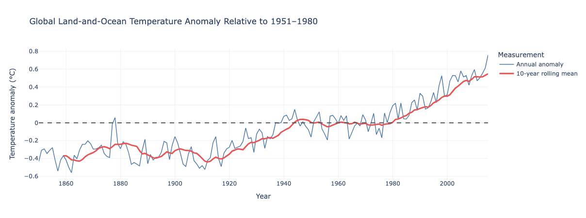

The annual series contains substantial short-term variation, while the rolling mean makes the longer-term pattern easier to interpret. The later decades in
the historical dataset contain predominantly positive anomalies relative to the project's 1951–1980 baseline.

This visualisation supports **BR1**, which requires the project to communicate long-term global temperature change.

### Hypothesis 1 — Temperature-period comparison

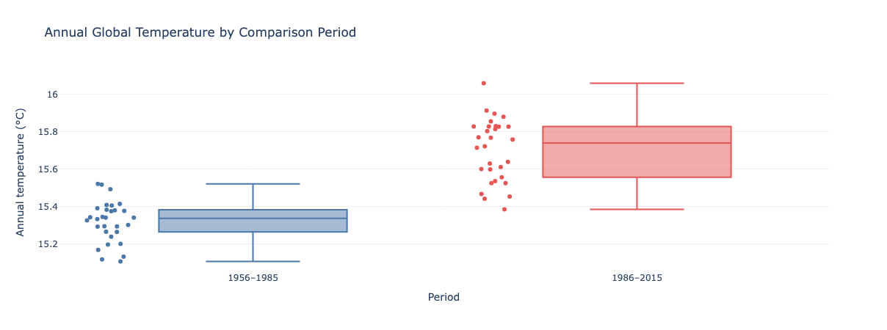

The distribution for 1986–2015 is positioned above the distribution for 1956–1985. The statistical analysis found a mean difference of **0.383 °C**,
supporting the first project hypothesis.

This box plot supports **BR4** by presenting the distribution and practical difference alongside the statistical test results.

### Hypothesis 2 — Measurement-uncertainty comparison

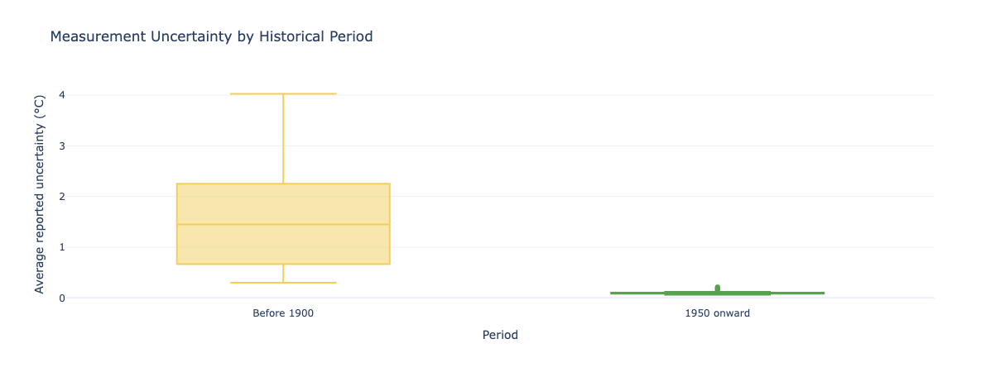

Reported measurement uncertainty is substantially higher in observations before 1900 than in observations from 1950 onward. This supports the second
project hypothesis while also demonstrating why older observations require careful interpretation.

This visualisation supports **BR2** and **BR4**.

### Country-level anomaly comparison

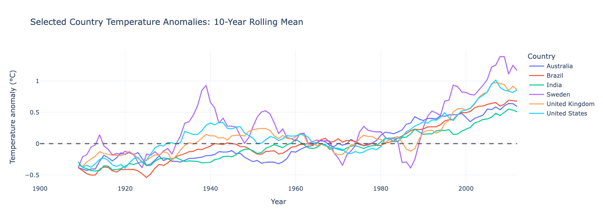

Country-specific anomalies allow areas with different absolute climates to be compared on a more meaningful basis. The figure demonstrates that geographical
temperature patterns vary and that the global average does not describe every location identically.

This visualisation supports **BR3**.

### Historical model predictions

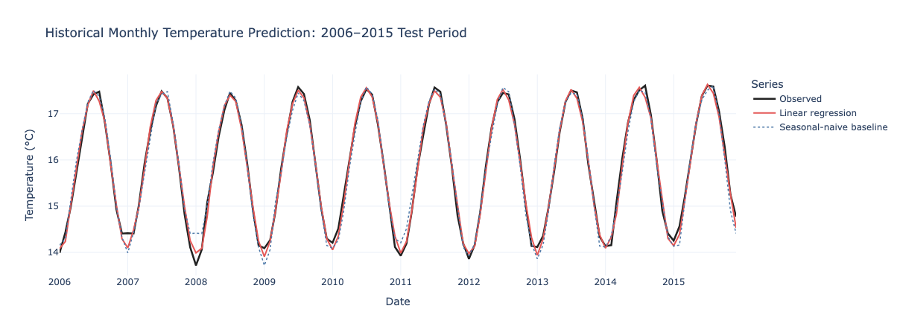

The figure compares observed test-period temperatures with the linear-model predictions and the seasonal-naive benchmark. The visual evidence complements
the reported MAE, RMSE and R² metrics without presenting the historical prototype as a future climate projection.

This visualisation supports **BR5**.


## Dashboard Design

ClimateLens uses a multipage Streamlit interface so users can move progressively from a general overview to detailed analysis.

### Information architecture

| Dashboard page | Purpose |
|---|---|
| Overview | Introduces the project, its historical-data limitations, principal metrics, key terminology, and responsible-use notice |
| Global Trends | Explores global temperature and measurement-uncertainty patterns over a user-selected period |
| Country Explorer | Compares country-specific temperature anomalies and equal-length historical periods |
| Hypotheses | Presents the two project hypotheses, statistical results, visual evidence, and plain-language conclusions |
| Model Performance | Compares the historical prediction model with a seasonal-naive benchmark and provides technical diagnostics |
| Ethics & Governance | Documents privacy, licensing, bias, social implications, governance controls, maintenance, and project risks |

### Deployed dashboard preview

The following screenshots show the deployed application and its principal
navigation pages.

#### Overview

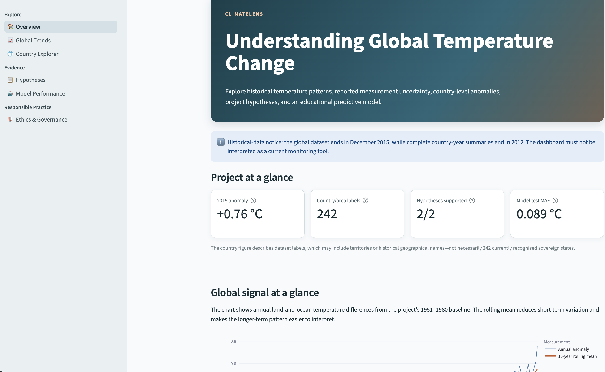

The Overview page introduces the project's purpose, historical-data scope, key
metrics and questions addressed by the dashboard.

#### Global Trends

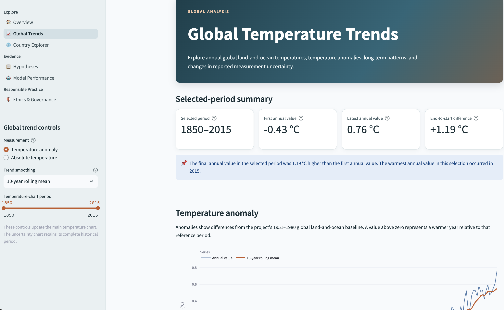
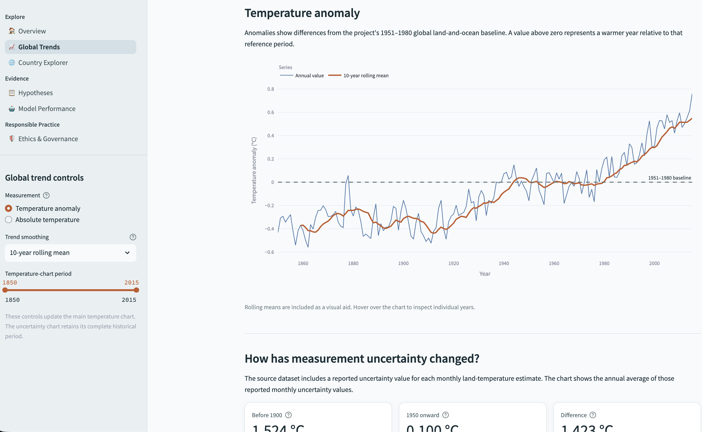


The Global Trends page presents annual temperature measurements, anomalies,
rolling trends and reported uncertainty.

#### Country Explorer

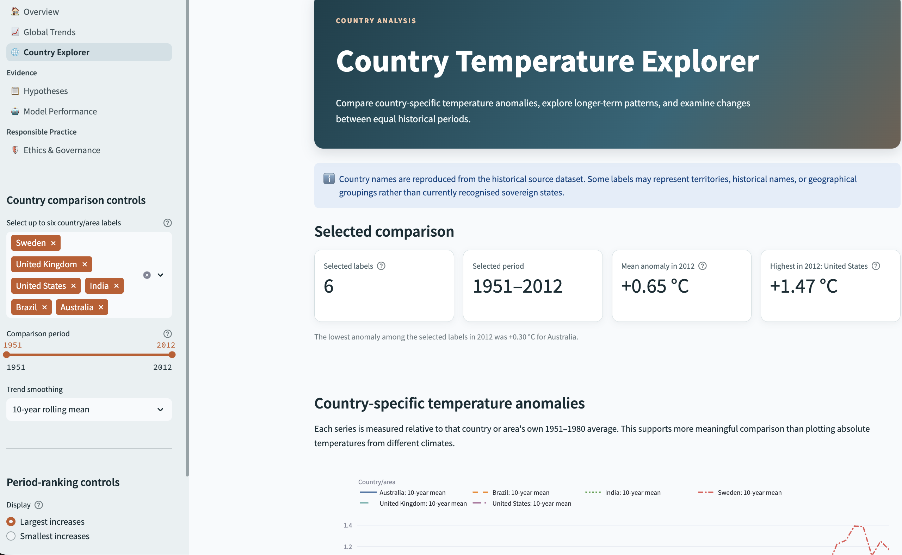
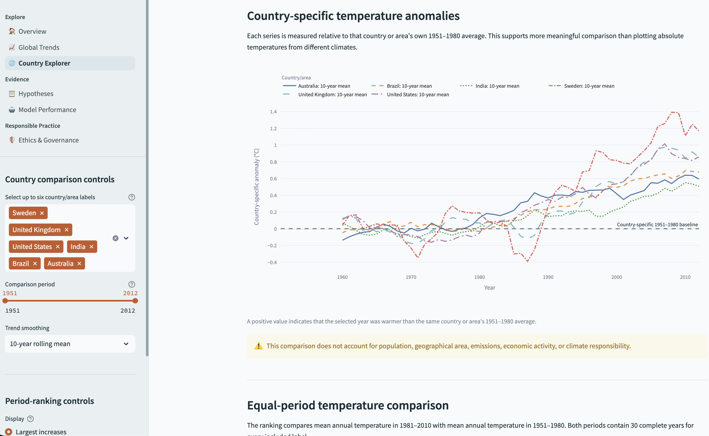

The Country Explorer supports interactive comparison of country and area
temperature anomalies over a shared historical period.

#### Hypotheses

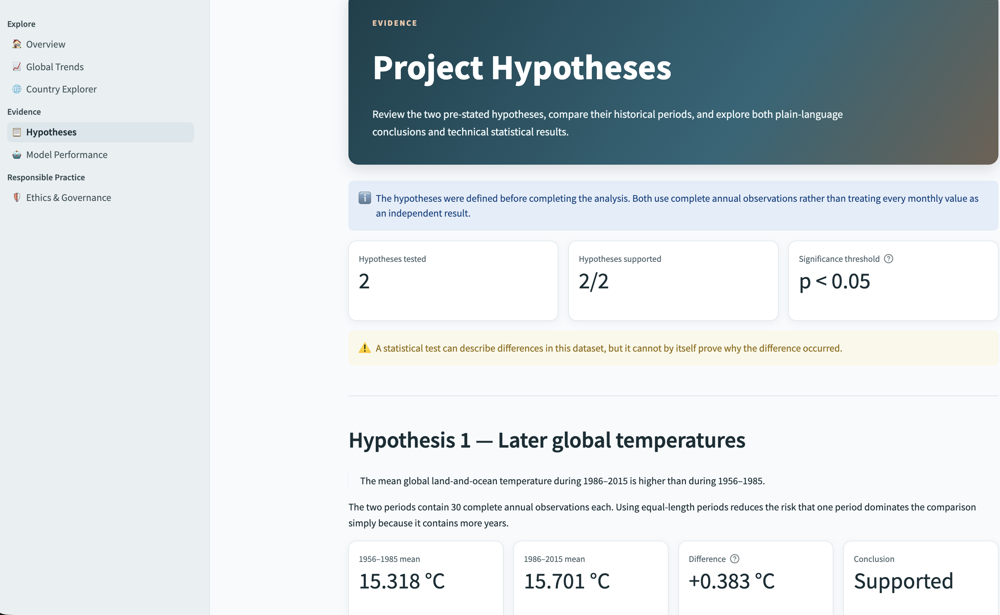
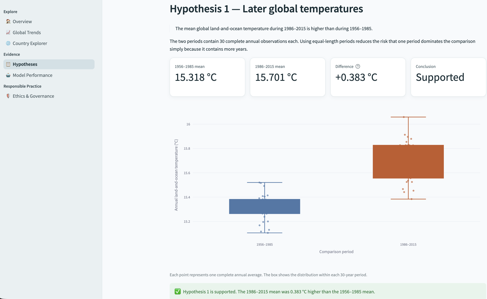

The Hypotheses page combines plain-language findings, distribution
visualisations and technical statistical results.

#### Model Performance

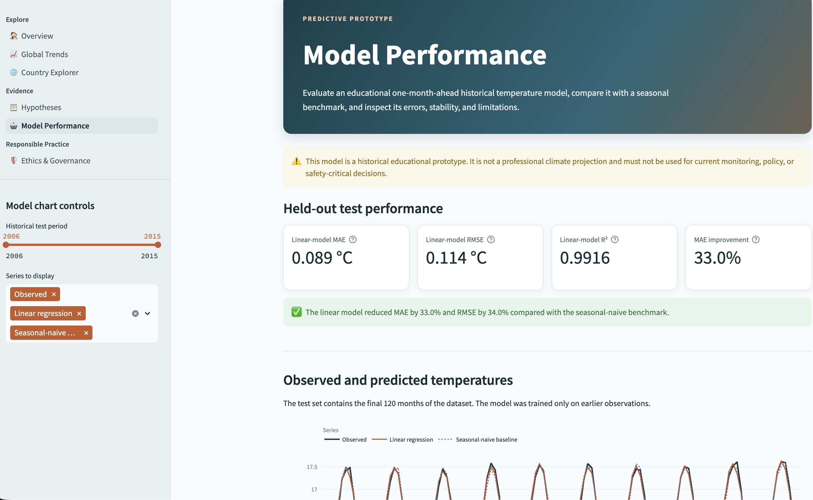
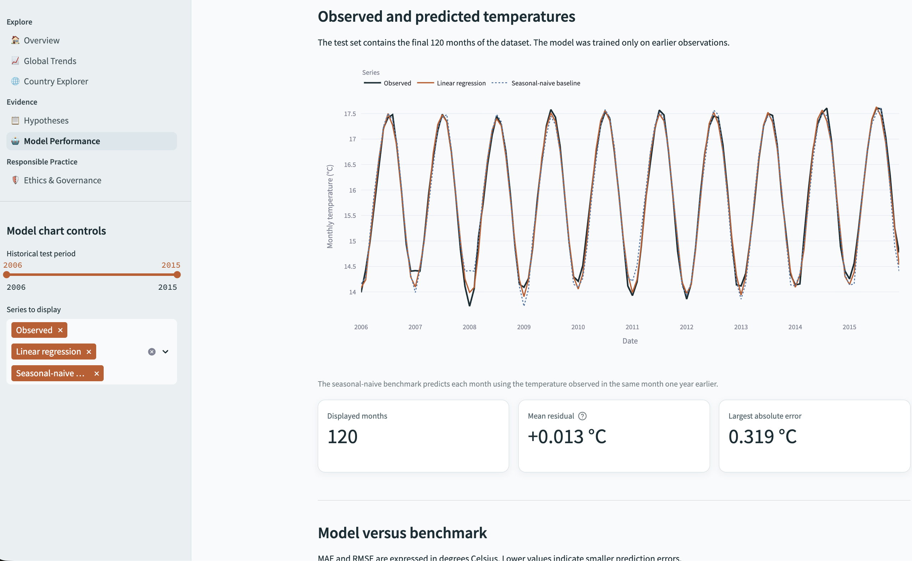

The Model Performance page compares the historical linear model with a
seasonal-naive benchmark and communicates the model's intended use and
limitations.

#### Ethics and Governance

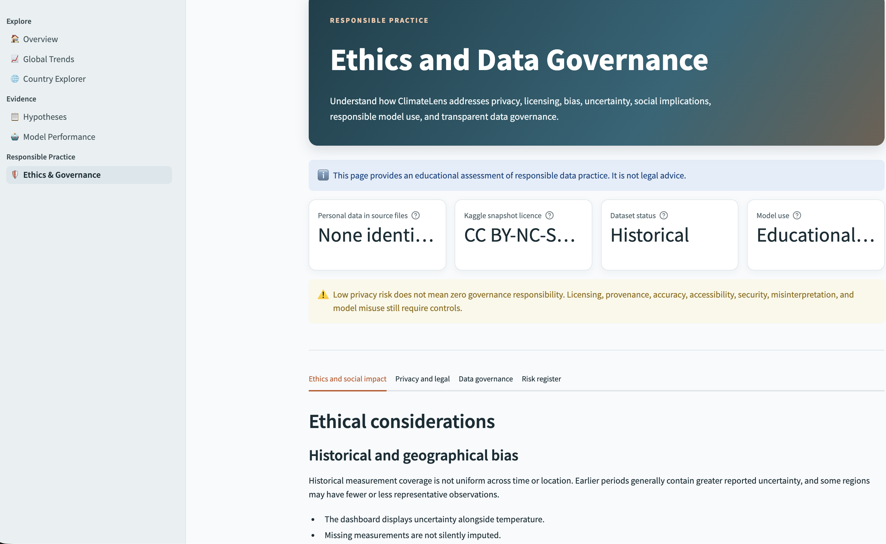

The Ethics and Governance page explains data provenance, privacy, licensing,
bias, social implications, governance controls and prohibited uses.

### Information hierarchy

Each page follows a consistent structure:

1. A page title and short explanation establish its purpose.
2. Controls allow users to select relevant data.
3. Summary metrics communicate the principal results.
4. Visualisations provide supporting evidence.
5. Captions and explanatory text clarify interpretation.
6. Limitations and responsible-use notices reduce the risk of misleading conclusions.
7. Detailed tables and downloads are placed later on the page for users who require further information.

This structure supports both non-technical users seeking concise findings and technical users who want supporting measurements and diagnostics.

### User control and feedback

The dashboard provides:

- sidebar navigation between pages;
- year-range and measurement selectors;
- country and area selectors;
- rolling-average controls;
- ranking-direction and ranking-size controls;
- model-series and test-period controls;
- expandable explanations for technical terminology;
- tabs for model diagnostics;
- downloadable filtered data and analytical results;
- informational, warning, and success messages that provide feedback and clarify limitations.

The dashboard does not use automatic pop-ups, audio, video, or interactions that remove user control.

### Consistency

Consistent colours, typography, spacing, metric cards, chart layouts, captions, and explanatory notices are used across the application.

Temperature series use a consistent visual language, while contrasting colours distinguish rolling averages, benchmarks, comparison periods, and uncertainty measurements.

All pages use the same wide layout and shared styling. Reusable chart, data-loading, and interface functions reduce unnecessary duplication in the code.

### Accessibility and responsive design

Accessibility decisions include:

- descriptive page headings and subheadings;
- plain-language explanations alongside technical results;
- meaningful chart titles, axis titles, legends, captions, and hover information;
- colours selected for adequate contrast against the dashboard background;
- information communicated through labels and values rather than colour alone;
- controls with visible text labels and help text;
- Celsius units displayed with temperature measurements;
- signed anomaly values that distinguish positive and negative results;
- expandable sections that reduce cognitive load;
- charts sized to their containers;
- Streamlit columns that reorganise when the available screen width is reduced.

The dashboard should still be manually tested at desktop, tablet, and mobile-width layouts before deployment.


## Rationale for Visualisations

The dashboard contains several different plot types. Each was selected according to the analytical question rather than for decoration.

| Visualisation | Location | Analytical purpose |
|---|---|---|
| Metric cards | Multiple pages | Communicate important values quickly, including anomalies, uncertainty, effect sizes, and model errors |
| Time-series line chart | Overview and Global Trends | Shows how temperature measurements and anomalies change chronologically |
| Rolling-mean line | Overview, Global Trends, and Country Explorer | Reduces short-term variation so the longer-term pattern is easier to interpret |
| Uncertainty line chart | Global Trends | Shows how reported measurement uncertainty changes through time |
| Multi-series anomaly line chart | Country Explorer | Allows selected countries or areas to be compared relative to their own 1951–1980 baselines |
| Horizontal bar chart | Country Explorer | Ranks equal-period historical temperature differences while keeping geographical labels readable |
| Box plots | Hypotheses | Compare distributions, medians, spread, and outliers between hypothesis groups |
| Observed-versus-predicted line chart | Model Performance | Shows how closely model and benchmark predictions follow held-out observations through time |
| Grouped bar chart | Model Performance | Compares model MAE and RMSE directly with the seasonal-naive benchmark |
| Residual histogram | Model Performance | Shows the distribution of prediction errors and whether residuals are centred near zero |
| Cross-validation bar chart | Model Performance | Compares prediction error across chronological validation folds |
| Coefficient bar chart | Model Performance | Shows the direction and relative magnitude of standardised predictive associations |

### Relationship to the business requirements

- Global time-series charts address **BR1** by explaining historical global temperature patterns.
- Uncertainty charts and comparison plots address **BR2** by communicating measurement reliability.
- Country anomaly lines and period-comparison bars address **BR3** by enabling geographical exploration.
- Box plots and statistical summaries address **BR4** by validating the project hypotheses.
- Prediction, benchmark, residual, validation, and coefficient charts address **BR5** by evaluating the historical predictive model.
- Captions, warnings, model limitations, and governance content address **BR6** by supporting responsible interpretation.

The dashboard therefore exceeds the requirement to display at least two different plot types. It uses line charts, bar charts, box plots, and a histogram, with each visual connected to a stated business requirement.


## Ethics, Privacy and Governance

This section examines ethical issues, privacy, legal considerations, social implications, and governance controls associated with ClimateLens.

It documents the project's approach to responsible data practice. It is an educational assessment and not legal advice.

### Ethical considerations

#### Historical and geographical bias

Historical temperature measurements do not provide uniform coverage across every period and location.

Earlier observations generally have greater reported uncertainty, while some regions may contain fewer or less representative measurements. Consequently, a value derived from one country, area, or historical period should not automatically be treated as equally reliable or representative of another.

The project reduces these risks by:

- displaying reported uncertainty alongside temperature;
- preserving missing values until their location and meaning have been investigated;
- avoiding automatic temperature imputation;
- using complete years for annual comparisons;
- comparing equal-length periods;
- using country-specific anomalies instead of directly ranking absolute temperatures from different climates;
- describing geographical values as dataset labels rather than assuming that every label represents a currently recognised sovereign state;
- documenting that the source data is historical.

Antarctica was excluded from the analytical country dataset because all 764 associated average-temperature measurements were missing. This exclusion is documented rather than hidden.

#### Fairness and responsible communication

ClimateLens is designed to avoid overstating what the data and model can demonstrate.

Practices used include:

- plain-language explanations alongside technical results;
- visible units, baselines, time periods, and data end dates;
- effect sizes and visual evidence alongside p-values;
- model error metrics alongside R²;
- comparison against a seasonal-naive benchmark;
- warnings placed close to potentially misleading charts;
- user-controlled filters and downloads;
- explicit distinction between association and causation.

The project avoids:

- presenting historical observations as current monitoring;
- interpreting statistical association as proof of climate causation;
- using temperature rankings as rankings of national responsibility;
- hiding measurement uncertainty;
- presenting model coefficients as causal effects;
- describing the predictive prototype as a professional climate projection.

### Privacy and GDPR

The European Commission describes personal data as information relating to an identified or identifiable living individual.

The analytical datasets used by ClimateLens contain:

- dates;
- temperature measurements;
- reported uncertainty;
- geographical labels;
- derived anomalies;
- aggregated model outputs.

No names, email addresses, account identifiers, or other person-level records were identified. The analytical dataset therefore presents a low GDPR risk.

The application also:

- does not ask users to register;
- does not request names or email addresses;
- does not accept user-uploaded files;
- does not intentionally collect precise user location;
- does not create user profiles;
- does not make automated decisions about individuals;
- does not intentionally include advertising or third-party behavioural analytics.

However, a deployed application may generate server logs. Depending on the hosting configuration, logs could include IP addresses or other online identifiers. The hosting provider's privacy, security, access, and retention documentation must therefore be reviewed before the application is treated as a production service.

If future versions introduce accounts, feedback forms, user uploads, analytics, or personalisation, the privacy assessment must be repeated.

Relevant GDPR principles for any future personal-data processing would include:

- lawfulness, fairness, and transparency;
- purpose limitation;
- data minimisation;
- accuracy;
- storage limitation;
- integrity and confidentiality;
- accountability.

Authoritative references:

- [European Commission — What is personal data?](https://commission.europa.eu/law/law-topic/data-protection/information-business-and-organisations/application-gdpr_en)
- [European Commission — GDPR processing principles](https://commission.europa.eu/law/law-topic/data-protection/information-business-and-organisations/principles-gdpr_en)

These references were reviewed on 1 September 2026.

### Dataset licence and attribution

The downloaded Kaggle snapshot is identified as licensed under **Creative Commons Attribution-NonCommercial-ShareAlike 4.0 International**, or **CC BY-NC-SA 4.0**.

Berkeley Earth describes its data more generally as available under **CC BY-NC 4.0** for non-commercial use. This project follows the more specific licence presented with the downloaded Kaggle snapshot.

The principal conditions are:

- **Attribution:** Kaggle and Berkeley Earth must be credited.
- **Non-commercial use:** the data is used for an educational, non-commercial capstone project.
- **Share alike:** adapted dataset material must be distributed under the required compatible terms.
- **Licence preservation:** the source and applicable licence information must remain documented.
- **Future review:** licensing must be checked again before commercial use, redistribution, or a material change in project purpose.

Dataset and licence references:

- [Kaggle — Climate Change: Earth Surface Temperature Data](https://www.kaggle.com/datasets/berkeleyearth/climate-change-earth-surface-temperature-data)
- [Berkeley Earth — Data Overview](https://berkeleyearth.org/data/)
- [Creative Commons — CC BY-NC-SA 4.0](https://creativecommons.org/licenses/by-nc-sa/4.0/)

The dataset was downloaded on 31 August 2026.

The licence applying to the dataset is separate from any licence applied to the project's original Python code.

### Social implications

Climate information can affect public understanding, education, organisational planning, and policy discussion. Misleading communication could encourage either unjustified alarm or unjustified dismissal of evidence.

Important limitations include:

- national averages can hide regional and community-level differences;
- temperature change alone does not measure vulnerability or resilience;
- temperature change does not measure historical greenhouse-gas emissions;
- temperature change does not establish national or individual responsibility;
- communities contributing least to emissions may still experience substantial impacts;
- historical trends should not be presented as current conditions;
- dashboard findings should be combined with authoritative scientific and social evidence before supporting real-world decisions.

The dashboard is therefore positioned as a public-awareness and educational tool rather than a policy, safety, or professional forecasting system.

### Generative AI transparency

Generative AI assistance was used during the project for:

- clarification of business requirements;
- planning the dashboard structure;
- suggestions for code and documentation;
- explanations of technical concepts;
- debugging support;
- reviewing communication and accessibility wording.

The project author remains responsible for:

- entering and executing the code;
- understanding the analytical methods;
- verifying calculated values against notebook outputs;
- reviewing generated suggestions;
- testing the application;
- documenting external sources;
- interpreting findings;
- making final design and implementation decisions.

AI-generated text or code was not treated as automatically correct. Statistical measurements were calculated from the project data, and external factual or legal statements were checked against appropriate sources.

### Data-governance approach

The project uses the following data lifecycle:

1. **Acquire:** download the documented Kaggle dataset snapshot.
2. **Preserve:** retain unchanged source files under `data/raw/v1/`.
3. **Inspect:** examine structure, dates, missing values, ranges, and duplicates.
4. **Clean:** document transformations in Jupyter notebooks.
5. **Version:** store generated files under `data/processed/v1/`.
6. **Validate:** reload exports and check expected structure and values.
7. **Analyse:** create complete-year analytical summaries.
8. **Model:** preserve chronological order and compare against a benchmark.
9. **Publish:** communicate provenance, limitations, intended use, and risks.
10. **Maintain:** review dependencies, links, data currency, tests, and documentation.
11. **Update or retire:** create a new version rather than silently overwriting historical data.

Technical and organisational controls include:

- separation of raw and processed data;
- dedicated version folders;
- reproducible notebook transformations;
- validation assertions;
- chronological model evaluation;
- exclusion of secrets and Kaggle credentials from Git;
- documentation of data provenance and licences;
- visible dataset and model limitations;
- focused Git commits for individual features and fixes;
- renewed validation when data or dependencies change;
- domain-expert review before any operational use.

### Risk register

| Risk | Likelihood | Impact | Mitigation |
|---|---|---|---|
| Historical data is interpreted as current | Medium | High | Display dataset end dates and historical-data notices |
| Temperature association is interpreted as causation | Medium | High | Use association language and provide causal limitations |
| Geographical coverage bias is overlooked | Medium | Medium | Display uncertainty and document coverage limitations |
| A country comparison is interpreted as climate responsibility | Medium | High | Explain that temperature change does not measure emissions, responsibility, or vulnerability |
| Predictive model is treated as a professional projection | Medium | High | Label it as an educational historical prototype and display a model card |
| Missing data is concealed through inappropriate imputation | Low | High | Preserve missingness, investigate its structure, and document exclusions |
| Model performance is overstated by R² | Medium | Medium | Report MAE, RMSE, residuals, cross-validation, and benchmark performance |
| Dataset licence requirements are breached | Low | High | Preserve attribution and licence documentation and restrict use to the stated educational purpose |
| Hosting logs introduce personal-data processing | Low | Medium | Review provider logging and retention policies before production use |
| Generative AI introduces incorrect content | Medium | Medium | Require author review, execution, testing, and source verification |

Residual risk remains because a public user may ignore explanatory text or reuse a chart without its surrounding limitations. Important caveats are therefore repeated close to the relevant outputs rather than appearing only on the governance page.


## Project Plan

ClimateLens follows an iterative data-analysis lifecycle. The plan is reviewed after each major phase so that decisions can respond to data-quality findings, technical constraints, user needs, and ethical risks.

### Project lifecycle

| Phase | Principal activities | Deliverable | Current status |
|---|---|---|---|
| 1. Project definition | Define the problem, purpose, audience, business requirements, and user stories | Project scope and requirements | Completed |
| 2. Data acquisition | Evaluate suitable datasets, select the Kaggle Berkeley Earth dataset, and record provenance and licensing | Versioned raw data | Completed |
| 3. Data inspection | Examine structure, dates, missing values, duplicates, labels, and ranges | Initial data-quality findings | Completed |
| 4. Data cleaning | Rename fields, convert dates, investigate missingness, remove unusable records, and validate exports | Cleaned Version 1 datasets | Completed |
| 5. Analysis | Create annual summaries, anomalies, descriptive statistics, and visual evidence | Analytical datasets and EDA findings | Completed |
| 6. Hypothesis testing | Define comparison periods, perform Welch tests, calculate effect sizes, and interpret limitations | Hypothesis results | Completed |
| 7. Predictive modelling | Engineer chronological features, train the model, create a benchmark, and evaluate performance | Model outputs and model card | Completed |
| 8. Dashboard implementation | Build the Streamlit navigation, pages, charts, controls, downloads, and responsive styling | Functional multipage dashboard | Completed |
| 9. Ethics and governance | Examine privacy, bias, licensing, social implications, AI use, and foreseeable risks | Ethics & Governance page | Completed |
| 10. Documentation | Document the complete lifecycle, decisions, results, testing, deployment, and credits | Structured README | Completed |
| 11. Verification | Test functions, pages, links, responsiveness, accessibility, and analytical consistency | Recorded test evidence | Completed |
| 12. Deployment | Prepare deployment files, reduce unnecessary deployment assets, deploy, and perform post-deployment tests | Public dashboard | Completed |
| 13. Maintenance and evaluation | Review dependencies, data currency, defects, user feedback, and continued fitness for purpose | Maintenance and evaluation record | Ongoing |

The implementation, documentation, verification, and deployment phases are complete. Maintenance and periodic evaluation remain ongoing activities.

### Implementation priorities

The implementation was prioritised in the following order:

1. Preserve and understand the original data.
2. Create reproducible cleaned and analytical files.
3. Validate the hypotheses and their limitations.
4. Build and benchmark the historical predictive model.
5. Create a usable dashboard around the business requirements.
6. Add accessibility, ethical communication, and governance controls.
7. Complete documentation and testing.
8. Deploy only after local verification.

This sequence prevented the interface from being designed around unverified assumptions about the data.

### Definition of done

The project will be considered complete when:

- all business requirements have corresponding dashboard functionality;
- all user stories have been reviewed against the finished application;
- all notebooks run in their intended sequence without logic errors;
- generated analytical files are stored in versioned folders;
- hypothesis results in the README match the calculated notebook outputs;
- model metrics in the README match the saved evaluation files;
- the dashboard contains at least two appropriate plot types;
- all pages load without obvious errors;
- navigation, filters, downloads, and expandable content work correctly;
- the interface has been checked at desktop, tablet, and mobile widths;
- accessibility and responsible-communication decisions are documented;
- privacy, licensing, bias, and social implications are addressed;
- manual and automated tests are recorded;
- the deployed application has been retested;
- the live application link has been added to the README;
- known limitations and unresolved defects are documented;
- the repository contains focused, descriptive commits.

### Review and revision of the plan

The original project plan changed as the data and application were investigated.

| Original assumption or problem | Review finding | Revision made |
|---|---|---|
| All files in the Kaggle dataset might be required | The project questions could be answered using the global and country files | City, state, and major-city files were excluded from scope |
| Missing temperatures might need to be filled | Missingness was structured and sometimes represented unavailable historical measurements | Temperatures were not automatically imputed |
| Every raw country label could be analysed | Antarctica contained 764 records but no usable average-temperature measurements | Antarctica was excluded and the decision was documented |
| The final country year could be included in annual comparison | Country observations ended in September 2013 | Complete annual summaries were limited to 2012 |
| Absolute country temperatures could be compared directly | Different climates make absolute-temperature rankings difficult to interpret | Country-specific 1951–1980 anomalies were used |
| A random train/test split could evaluate the model | Random splitting would leak future time information into training | Chronological training, testing, and expanding-window validation were used |
| Model performance could be presented without a simple comparator | Metrics alone do not show whether the model adds useful predictive value | A seasonal-naive benchmark was added |
| R² could provide the main model summary | Seasonal temperature variation can make R² appear very high | MAE, RMSE, residuals, cross-validation, and benchmark results were emphasised |
| A single dashboard page might be sufficient | The amount of analysis created an unclear information hierarchy | The application was separated into six purpose-specific pages |
| Automatically responsive Plotly charts would size correctly | Some charts overlapped following Streamlit layout changes | Explicit chart heights and shared spacing rules were introduced |
| Markdown containing HTML links would render consistently | Some links appeared as raw HTML in the application | Link markup was corrected and visually retested |
| Technical explanations could remain in notebooks | Non-technical dashboard users also needed definitions and limitations | Plain-language explanations, captions, expanders, and warnings were added |
| Ethics could be documented only in the README | Important limitations should also be visible to dashboard users | A dedicated Ethics & Governance page was created |

These revisions demonstrate that the project plan was treated as a living document rather than a fixed sequence of tasks.


## Maintenance, Updates and Evaluation

### Maintenance plan

If the project continues after assessment, the following maintenance activities should be performed.

| Activity | Frequency | Action |
|---|---|---|
| Application smoke test | Before every release | Open every page and test principal controls |
| External-link review | Before every release | Confirm dataset, licence, legal, and scientific links still work |
| Dependency review | Before every release and periodically afterward | Check compatibility, deprecations, and relevant security notices |
| Data-currency review | At least annually | Check whether a newer suitable dataset is available |
| Analytical validation | After every data or logic change | Rerun notebooks and compare outputs with documented results |
| Accessibility review | After interface changes | Retest headings, labels, contrast, resizing, and keyboard interaction |
| Performance review | After data or dependency changes | Check application start-up and interaction times |
| Privacy review | Before hosting changes or new user features | Examine logging, retention, analytics, uploads, and personal-data processing |
| Licence review | Before redistribution or a change in use | Confirm attribution and non-commercial/share-alike requirements |
| Risk-register review | Before every significant release | Add new risks and update mitigation measures |
| Documentation review | Before every release | Update dates, results, known issues, screenshots, and instructions |

### Data-update policy

A new dataset must not silently replace Version 1.

Future data updates should follow this procedure:

1. Record the new data source, download date, licence, and file checksum if available.
2. Store the unchanged source under a new folder such as `data/raw/v2/`.
3. Copy the existing notebooks before modifying the cleaning logic.
4. Repeat the data-quality investigation.
5. Document differences in structure, coverage, missingness, and labels.
6. Save generated files under `data/processed/v2/`.
7. Rerun hypothesis tests and model evaluation.
8. Compare Version 2 results with the documented Version 1 results.
9. Retest every dashboard page.
10. Update the README, data notices, model card, and risk register.
11. Preserve Version 1 so historical results remain reproducible.

If a new dataset uses a different baseline or methodology, its outputs should not be presented as directly comparable until that compatibility has been evaluated.

### Future development

A future version of ClimateLens could combine temperature records with additional environmental and socioeconomic datasets. Potential areas for
investigation include:

- sea-level change;
- crop yields and food security;
- water availability;
- energy consumption and seasonal energy demand;
- biodiversity and ecosystem indicators;
- extreme-weather frequency or intensity.

These additions could support correlation and time-lag analysis to investigate whether changes in temperature are associated with changes in other systems. The dashboard could then provide linked visualisations showing how different indicators change over time.

Such analysis would require careful selection of compatible geographical and time periods, investigation of missing data, and consideration of confounding variables. Any observed correlation would be presented as an association and would not, by itself, demonstrate that temperature change caused the other observed change.

### Evaluation plan

The completed project will be evaluated across five areas.

| Evaluation area | Questions |
|---|---|
| Functional suitability | Do all pages, filters, tabs, downloads, and navigation controls work as intended? |
| Analytical correctness | Do dashboard values match processed data, hypothesis results, and saved model metrics? |
| Communication | Can technical and non-technical users understand the main findings and limitations? |
| UX and accessibility | Is information easy to find, readable, consistently presented, and usable at different screen sizes? |
| Ethics and governance | Are privacy, bias, licensing, uncertainty, social impact, intended use, and residual risks communicated clearly? |

### Evaluation measures

Evidence should include:

- successful notebook execution;
- validation assertions;
- automated function tests where practical;
- manual dashboard test cases;
- link checks;
- responsive-layout checks;
- comparison of dashboard values with processed CSV files;
- comparison of model results with the seasonal-naive benchmark;
- user feedback from at least one technical and one non-technical reviewer where practical;
- documented defects, corrections, and retest results;
- a final post-deployment smoke test.

### User-feedback questions

Test users can be asked:

1. Is the purpose of ClimateLens clear from the Overview page?
2. Can you identify the final year covered by the data?
3. Can you explain what a temperature anomaly means?
4. Can you find and compare two countries or areas?
5. Can you identify whether each hypothesis was supported?
6. Can you tell whether the model outperformed its benchmark?
7. Is it clear that the model is not a professional climate projection?
8. Can you locate the data source and licence?
9. Are any controls, charts, labels, or explanations confusing?
10. Does the dashboard remain usable on your screen size?

Feedback should be recorded with the identified issue, its priority, the action taken, and the retest outcome.

### Release and rollback approach

Before releasing an update:

- create focused commits for each completed change;
- confirm that raw files have not been altered;
- rerun relevant notebooks;
- verify generated outputs;
- run the complete test plan;
- update documentation;
- tag or otherwise identify the tested release.

If an update introduces a serious defect, the application should return to the last verified Git revision while the issue is investigated. Data versions should be retained rather than overwritten, making analytical rollback possible.


## Challenges and Project Retrospective

This retrospective records practical challenges encountered during the project, the decisions made in response, and lessons that should influence future development.

### Practical challenges

| Challenge | Effect on the project | Response | Lesson learned |
|---|---|---|---|
| Selecting a dataset with sufficient historical and geographical coverage | Several possible environmental datasets could meet the broad project theme | The Berkeley Earth Kaggle dataset was selected because it supported global trends, country comparisons, uncertainty analysis, hypotheses, and predictive modelling | Dataset selection should be driven by business requirements rather than popularity alone |
| Understanding the dataset licence | Kaggle and Berkeley Earth displayed related but not identical Creative Commons licence descriptions | The more specific CC BY-NC-SA 4.0 licence shown with the downloaded Kaggle snapshot was documented and followed | Licensing should be investigated before analysis and deployment, not added as an afterthought |
| Large country dataset | The raw country file contains 577,462 rows and increases processing and deployment size | Reusable processed annual summaries were created so the dashboard does not repeat expensive transformations | Analytical dashboards should load purpose-built data rather than reproduce notebook cleaning on every run |
| Structured historical missingness | Some temperature fields were unavailable for complete historical periods | Missing values were investigated by column and period instead of being automatically filled | Missing data can contain information about measurement history and should not be treated only as a technical inconvenience |
| Antarctica contained no usable temperature values | The label appeared in the source but could not contribute to the country analysis | Its 764 unusable records were excluded, with the reason documented | Exclusions must be evidence-based, reproducible, and visible |
| Country data ended during September 2013 | Including 2013 would create an unfair annual comparison with complete years | Complete country-year summaries were limited to 2012 | Temporal completeness must be checked before aggregating monthly observations |
| Comparing countries with different climates | Absolute temperature rankings would mainly reflect geographical climate differences | Country-specific anomalies were calculated relative to each label's own 1951–1980 mean | Normalisation and reference periods should reflect the analytical question |
| Risk of time-series leakage | Random train/test splitting would allow later observations to influence evaluation of earlier periods | Chronological training and testing, past-only features, and expanding-window validation were used | Time order is part of the data and must be preserved during modelling |
| Interpreting high model R² | Strong seasonal patterns produced a very high R² that could be overstated | MAE, RMSE, residuals, cross-validation, and a seasonal-naive benchmark were also reported | A model metric has meaning only when interpreted with suitable context and comparison |
| Distinguishing prediction from climate projection | Users could interpret the prototype as a professional future climate model | A model card, historical-data notices, intended-use statements, and repeated limitations were added | Responsible model communication is part of implementation rather than optional documentation |
| Communicating statistical hypothesis results | P-values and effect sizes may be inaccessible to non-technical users | Technical outputs were paired with metric cards, box plots, plain-language conclusions, and limitations | Presenting evidence requires both statistical precision and audience-appropriate explanation |
| Notebook Plotly rendering failed | `figure.show()` raised an error because the notebook renderer required `nbformat` | `nbformat==5.10.4` was added to the project dependencies and the environment was restarted | Reproducibility depends on documenting rendering and notebook dependencies as well as analytical packages |
| Scientific-analysis dependencies needed to be reproducible | Statistical functions relied on packages that must also be present in a fresh environment | Compatible scientific packages, including SciPy, were added to the pinned requirements | A working local environment is not sufficient unless its dependencies can be reproduced elsewhere |
| Charts overlapped following layout changes | Chart content, headings, and following sections appeared on top of one another | Explicit Plotly chart heights and shared Streamlit spacing rules were introduced | Responsive behaviour must be visually tested instead of assumed |
| External links displayed as raw HTML | Some source-link markup appeared as text in the dashboard | Link strings were corrected and configured to open safely in a separate tab | Small presentation defects can undermine confidence in an otherwise professional interface |
| Multipage navigation needed to remain clear | A large single page would make different analytical questions difficult to find | Six focused pages were registered through a central Streamlit navigation structure | Information architecture should reflect user tasks rather than code structure |
| Balancing technical and non-technical content | Too much detail could overwhelm general users, while too little would weaken analytical transparency | Summary cards and narratives appear first, with tables, diagnostics, and downloads available later | Progressive disclosure can serve audiences with different levels of technical knowledge |
| Repeating limitations without overwhelming users | A single disclaimer could easily be missed, but excessive warnings could interrupt the data story | Short, relevant limitations were placed close to affected outputs, with full detail on the governance page | Responsible communication works best when caveats are contextual |
| Repository and deployment size | Raw and cleaned monthly files are relatively large | File-size and deployment exclusions were identified as a required pre-deployment review | Development assets and runtime assets should be separated before deployment |

### What worked well

The following approaches were effective:

- defining business requirements before building the dashboard;
- separating raw, processed, analytical, and model outputs;
- preserving raw Version 1 data without modification;
- using notebooks to create a visible analytical workflow;
- verifying exported files after saving them;
- using complete-year filters for fair annual comparisons;
- using anomalies instead of misleading absolute country rankings;
- comparing the predictive model with a simple benchmark;
- organising application code into reusable data, chart, and UI modules;
- separating the dashboard into purpose-specific pages;
- placing plain-language narratives alongside technical measurements;
- documenting uncertainty, privacy, bias, licensing, social implications, and model limitations;
- using focused Git commits to make the development process understandable.

### Constraints and trade-offs

#### Historical data currency

The selected dataset provides valuable long-term coverage but is not current. Global observations end in December 2015, while complete country summaries end in 2012.

A newer source could improve currency, but changing datasets during development would alter the methodology, baselines, hypotheses, and model outputs. The project therefore retains the documented Version 1 snapshot and communicates its historical scope clearly.

#### Scope control

The Kaggle dataset also contains city, state, and major-city files. Including every file could create more visualisations but would increase cleaning, validation, interface, and governance work without directly supporting the selected requirements.

The project prioritised depth and clarity in the global and country analyses.

#### Statistical simplicity

Welch tests provide an understandable comparison of group means, but they do not represent the complete time-dependent process. More advanced approaches could model autocorrelation and structural changes more directly.

The selected tests were retained because they are transparent and appropriate for an educational prototype when their limitations are documented.

#### Model simplicity

Linear regression is interpretable and provides a useful historical prototype. It cannot reproduce the scientific capabilities of physical climate models and is not designed for long-range recursive forecasting.

A more complex model could improve some prediction metrics while reducing interpretability and increasing the risk of presenting the result as more authoritative than the data supports.

#### Geographical interpretation

The source uses country and area labels accumulated across a long historical period. These labels may include territories, historical names, duplicated geographical concepts, or boundaries that changed over time.

The dashboard therefore refers to 242 country or area labels rather than claiming that they represent 242 current sovereign states.

### What could be improved

Given additional time and suitable data, the project could be improved by:

- incorporating a more current authoritative temperature dataset;
- harmonising historical geographical labels;
- adding geographical coordinates and a carefully designed map;
- analysing regional and seasonal differences;
- adding emissions, vulnerability, or socioeconomic data without implying unsupported causation;
- applying time-series methods that explicitly model autocorrelation;
- evaluating additional interpretable model types;
- automating more data and interface tests;
- adding formal accessibility testing;
- conducting structured usability sessions with technical and non-technical users;
- obtaining review from a climate-data or environmental-domain expert;
- monitoring application performance after deployment;
- creating a documented Version 2 update rather than replacing Version 1.

### Lessons learned

This project demonstrated that successful data communication requires more than calculating correct values.

The principal lessons were:

1. Business requirements should guide dataset selection and visualisation.
2. Data cleaning decisions must be justified rather than hidden.
3. Missingness, uncertainty, and historical coverage are part of the analytical story.
4. Time-series evaluation must preserve chronology.
5. Model performance should always be compared with an appropriate benchmark.
6. Statistical significance should not be presented as causal proof.
7. Technical and non-technical audiences require different levels of detail.
8. Ethical, legal, and social considerations influence design and implementation.
9. Responsive and accessible behaviour requires practical testing.
10. Documentation and commit history are part of the finished product.
11. Generative AI suggestions still require human verification and responsibility.
12. A project plan should change when evidence shows that an original assumption was unsuitable.


## Testing

ClimateLens was tested using automated validation, manual functional checks, responsive-layout testing, accessibility review, browser-compatibility testing, and external-link testing.

Local results include:

- 19 automated tests passed;
- 47 manual functional tests passed;
- 10 responsive-layout tests passed;
- 12 accessibility tests passed;
- compatibility tests passed in Chrome, Safari, and Firefox;
- all external-link tests passed;
- all identified defects were corrected and retested.

Post-deployment verification confirmed that:

- all six public routes load successfully;
- all expected Plotly charts render;
- model metrics match the saved analytical results;
- no Streamlit exceptions or browser-console errors appear;
- representative mobile-width pages have no horizontal overflow;
- historical-data limitations remain visible.

The deployed tests were completed on 2 September 2026.

Detailed test cases, results, resolved defects, and known limitations are documented in [TESTING.md](TESTING.md).


## Deployment

ClimateLens is deployed on Heroku:

[View the live ClimateLens dashboard](https://climatelens-global-temperature-54cc5c60cb7b.herokuapp.com/)

### Deployment method

The application was deployed from the GitHub `main` branch using Heroku's GitHub integration.

The deployment process was:

1. Create a Heroku application in the Europe region.
2. Configure the Python buildpack.
3. Connect the Heroku application to the GitHub repository.
4. Select the `main` branch.
5. Perform a manual deployment.
6. Review the build output.
7. Open and test the public application.

### Deployment configuration

| File | Purpose |
|---|---|
| `.python-version` | Requests the latest supported Python 3.12 patch release |
| `requirements.txt` | Contains production-only Python dependencies |
| `Procfile` | Starts Streamlit using Heroku's assigned `$PORT` |
| `.streamlit/config.toml` | Defines theme, headless mode, and telemetry preference |
| `.slugignore` | Excludes notebooks, tests, documentation, raw data, and large monthly analytical files from the deployment slug |

The production command is:

```text
streamlit run app.py --server.port=$PORT --server.address=0.0.0.0
```


## Technologies

ClimateLens uses Python as its only programming language. Markdown, CSS, TOML, and configuration files support documentation, presentation, and deployment.

| Technology | Version | Purpose |
|---|---:|---|
| Python | 3.12 | Principal programming language |
| Streamlit | 1.40.2 | Multipage dashboard framework |
| Pandas | 2.1.1 | Data loading, transformation, aggregation, and analysis |
| NumPy | 1.26.1 | Numerical calculations and model feature engineering |
| Plotly | 5.17.0 | Interactive dashboard and notebook visualisations |
| SciPy | 1.11.3 | Welch hypothesis tests and statistical calculations |
| scikit-learn | 1.3.1 | Linear-regression pipeline, scaling, metrics, and chronological validation |
| nbformat | 5.10.4 | Plotly rendering within Jupyter notebooks |
| ipykernel | 7.3.0 | Python kernel used to execute notebooks in VS Code |
| pytest | 9.1.1 | Automated data, chart, and Streamlit smoke testing |
| CSS | — | Custom responsive dashboard presentation |
| Git | — | Local version control |
| GitHub | — | Remote repository and development history |
| Heroku | — | Public application hosting |
| Kaggle | — | Distribution source for the Berkeley Earth dataset |

### Dependency groups

Dependencies are separated according to purpose:

| File | Purpose |
|---|---|
| `requirements.txt` | Small production dependency set used by Heroku |
| `requirements-analysis.txt` | Production dependencies plus notebook analysis and kernel packages |
| `requirements-dev.txt` | Production dependencies plus pytest |

This separation prevents notebook-only modelling libraries from increasing production deployment time and size.


## Project Structure

```text
.
├── .streamlit/
│   └── config.toml
├── assets/
│   └── style.css
├── data/
│   ├── raw/
│   │   └── v1/
│   │       ├── GlobalLandTemperaturesByCountry.csv
│   │       ├── GlobalTemperatures.csv
│   │       └── README.md
│   └── processed/
│       └── v1/
│           ├── cleaning_summary.csv
│           ├── country_annual_summary.csv
│           ├── country_temperatures_clean.csv
│           ├── global_annual_summary.csv
│           ├── global_temperatures_clean.csv
│           ├── hypothesis_results.csv
│           ├── model_coefficients.csv
│           ├── model_cross_validation.csv
│           ├── model_metrics.csv
│           └── model_test_predictions.csv
├── jupyter_notebooks/
│   ├── 01_data_collection_and_inspection.ipynb
│   ├── 02_data_cleaning_and_validation.ipynb
│   ├── 03_exploratory_analysis_and_hypothesis_validation.ipynb
│   ├── 04_predictive_modelling.ipynb
│   └── Notebook_Template.ipynb
├── src/
│   ├── __init__.py
│   ├── charts.py
│   ├── data_loader.py
│   └── ui.py
├── tests/
│   ├── test_charts.py
│   ├── test_data_loader.py
│   └── test_streamlit_pages.py
├── views/
│   ├── country_explorer.py
│   ├── ethics_governance.py
│   ├── global_trends.py
│   ├── hypotheses.py
│   ├── model_performance.py
│   └── overview.py
├── .gitignore
├── .python-version
├── .slugignore
├── app.py
├── Procfile
├── README.md
├── TESTING.md
├── requirements-analysis.txt
├── requirements-dev.txt
└── requirements.txt
```

### Principal application files

| File or directory | Responsibility |
|---|---|
| `app.py` | Configures Streamlit and registers the six dashboard pages |
| `views/` | Contains the user-facing dashboard pages |
| `src/data_loader.py` | Loads and validates versioned dashboard data |
| `src/charts.py` | Contains reusable Plotly chart functions |
| `src/ui.py` | Contains shared interface and presentation helpers |
| `assets/style.css` | Provides custom responsive styling |
| `jupyter_notebooks/` | Documents data acquisition, cleaning, analysis, hypotheses, and modelling |
| `data/raw/v1/` | Preserves the unchanged source snapshot |
| `data/processed/v1/` | Stores reproducible cleaned and analytical outputs |
| `tests/` | Contains automated validation and smoke tests |
| `TESTING.md` | Records automated, manual, responsive, accessibility, browser, and deployed tests |


## Local Development

### Prerequisites

To run ClimateLens locally, install:

- Git;
- Python 3.12;
- a code editor such as VS Code;
- the VS Code Python and Jupyter extensions when reviewing notebooks.

### Clone the repository

```bash
git clone https://github.com/Ellusive89/CI-Project3-ClimateLens-Understanding-Global-Temperature-Change.git
```

Enter the project directory:

```bash
cd CI-Project3-ClimateLens-Understanding-Global-Temperature-Change
```

### Create and activate a virtual environment

Create the environment:

```bash
python3.12 -m venv .venv
```

Activate it on macOS or Linux:

```bash
source .venv/bin/activate
```

On Windows PowerShell:

```powershell
.venv\Scripts\Activate.ps1
```

Upgrade pip:

```bash
python -m pip install --upgrade pip
```

### Run the dashboard

Install the production dependencies:

```bash
python -m pip install -r requirements.txt
```

Start Streamlit from the repository root:

```bash
streamlit run app.py
```

Open the local address displayed in the terminal, normally:

```text
http://localhost:8501
```

Stop the server with `Control + C`.

If port 8501 is unavailable, use:

```bash
streamlit run app.py --server.port=8502
```

### Run the analytical notebooks

Install the analysis dependencies:

```bash
python -m pip install -r requirements-analysis.txt
```

In VS Code:

1. Open the repository folder.
2. Open a notebook.
3. Select the Python interpreter from `.venv`.
4. Run notebooks in numerical order.

The intended execution order is:

1. `01_data_collection_and_inspection.ipynb`
2. `02_data_cleaning_and_validation.ipynb`
3. `03_exploratory_analysis_and_hypothesis_validation.ipynb`
4. `04_predictive_modelling.ipynb`

Running notebooks in order recreates the processed Version 1 analytical files used by the dashboard.

The two selected raw CSV files are versioned in the repository, so Kaggle credentials are not required to reproduce the existing Version 1 analysis.

### Run the automated tests

Install the testing dependencies:

```bash
python -m pip install -r requirements-dev.txt
```

Run the complete suite:

```bash
python -m pytest -v
```

The documented result is:

```text
19 passed
```

Two non-failing Plotly/Pandas compatibility warnings may appear. Further details are recorded in [TESTING.md](TESTING.md).

### Configuration and secrets

ClimateLens does not require application secrets, API keys, a database, or user accounts.

Kaggle credentials must never be committed. The repository's `.gitignore` excludes `kaggle.json`.

The application must be started from the repository root so relative data, view, and asset paths resolve consistently.


## Assessment Criteria Mapping

This section identifies where evidence for each pass criterion can be found.

### Learning Outcome 1

> Understand ethical considerations, data privacy, and governance in data analytics practices.

| Criterion | Required evidence | ClimateLens evidence |
|---|---|---|
| 1.1 | Examine ethical issues, privacy, and governance in the project methodology | The [Ethics, Privacy and Governance](#ethics-privacy-and-governance) section examines historical and geographical bias, missing-data decisions, fairness, uncertainty, model communication, privacy, AI transparency, governance controls, and residual risk. The dashboard provides the same evidence through the [Ethics & Governance page](views/ethics_governance.py). |
| 1.2 | Evaluate legal and social implications and justify responsible, compliant practice | The README and dashboard discuss GDPR relevance, potential hosting logs, data minimisation, licence conditions, attribution, non-commercial use, social impacts, country-ranking risks, climate responsibility, and future privacy reassessment. Authoritative European Commission and Creative Commons references are provided. |

### Learning Outcome 2

> Clarify and present complex data insights to technical and non-technical audiences.

| Criterion | Required evidence | ClimateLens evidence |
|---|---|---|
| 2.1 | Present complex insights accessibly to technical and non-technical audiences | Overview cards, plain-language definitions, chart captions, technical expanders, hypothesis conclusions, statistical outputs, model metrics, benchmark comparison, and the model card support different knowledge levels. The Hypotheses page includes separate plain-language and technical interpretations. |
| 2.2 | Use appropriate visualisations and narratives to enhance understanding | The [Rationale for Visualisations](#rationale-for-visualisations) connects line charts, rolling means, box plots, bar charts, residual histograms, and metric cards to business requirements. The [Dashboard Design](#dashboard-design) explains navigation, information hierarchy, accessibility, feedback, responsiveness, and user control. |
| 2.3 | Organise project documentation clearly and accessibly | The project includes a structured README, [TESTING.md](TESTING.md), four ordered analytical notebooks, versioned data documentation, code docstrings, comments, chart labels, units, hover information, captions, warnings, model documentation, and deployment instructions. |

### Learning Outcome 3

> Review and revise data-analytics project plans.

| Criterion | Required evidence | ClimateLens evidence |
|---|---|---|
| 3.1 | Present a complete plan covering implementation, maintenance, updates, and evaluation | The [Project Plan](#project-plan) records thirteen lifecycle phases and completion status. [Maintenance, Updates and Evaluation](#maintenance-updates-and-evaluation) covers release checks, data versioning, evaluation questions, user feedback, maintenance frequency, and rollback. [Deployment](#deployment) documents publication and update procedures. |
| 3.2 | Reflect on practical execution challenges and considerations | [Challenges and Project Retrospective](#challenges-and-project-retrospective) discusses data selection, licensing, missingness, incomplete periods, geographical comparisons, time leakage, model interpretation, package dependencies, responsive layout, communication trade-offs, and lessons learned. [TESTING.md](TESTING.md) records defects, resolutions, retesting, known limitations, and post-deployment results. |

### Business-requirement traceability

| Requirement | Implementation | Evidence |
|---|---|---|
| BR1 — Communicate historical global temperature patterns | Interactive global anomaly and absolute-temperature charts, rolling averages, selected-period metrics, and downloadable data | [Global Trends page](views/global_trends.py), [global analysis notebook](jupyter_notebooks/03_exploratory_analysis_and_hypothesis_validation.ipynb) |
| BR2 — Communicate historical measurement uncertainty | Uncertainty time series, comparison periods, summary metrics, explanations, and Hypothesis 2 | [Global Trends page](views/global_trends.py), [Hypotheses page](views/hypotheses.py) |
| BR3 — Enable country and area comparison | Country-specific anomalies, six-label comparison, equal-period rankings, controls, caveats, and downloads | [Country Explorer page](views/country_explorer.py) |
| BR4 — Validate the project hypotheses | Welch tests, effect sizes, box plots, technical details, plain-language conclusions, and downloadable results | [Hypotheses page](views/hypotheses.py), [hypothesis notebook](jupyter_notebooks/03_exploratory_analysis_and_hypothesis_validation.ipynb) |
| BR5 — Develop and evaluate an educational predictive model | Chronological features, held-out testing, expanding-window validation, seasonal-naive benchmark, residuals, coefficients, and model card | [Model Performance page](views/model_performance.py), [modelling notebook](jupyter_notebooks/04_predictive_modelling.ipynb) |
| BR6 — Support responsible and accessible interpretation | Historical-data notices, definitions, accessible labels, ethical safeguards, privacy discussion, licensing, AI transparency, and risk register | [Overview page](views/overview.py), [Ethics & Governance page](views/ethics_governance.py) |

### Additional project requirements

| Requirement | Evidence |
|---|---|
| Fully functioning Python dashboard | Deployed [ClimateLens dashboard](https://climatelens-global-temperature-54cc5c60cb7b.herokuapp.com/) |
| Business Intelligence or dashboard tool | Streamlit multipage application |
| Python as the only programming language | All custom analytical and application logic is written in Python |
| At least two plot types | Line charts, box plots, bar charts, and a histogram are included |
| Hypotheses documented and validated | [Project Hypotheses](#project-hypotheses) and saved statistical results |
| Versioned notebook outputs | Raw and processed files are stored under dedicated `v1` folders |
| Clean and organised code | Reusable `src`, `views`, and `tests` modules with docstrings and focused responsibilities |
| Effective Git usage | Focused commits document data, notebook, dashboard, testing, documentation, and deployment changes |
| Responsive and accessible design | Dashboard design evidence and responsive/accessibility results in [TESTING.md](TESTING.md) |
| Complete lifecycle documentation | README sections cover purpose, data, methodology, design, modelling, ethics, planning, reflection, testing, deployment, and maintenance |


## Credits and Acknowledgements

### Data source

ClimateLens uses the Berkeley Earth surface-temperature dataset distributed through Kaggle:

- [Kaggle — Climate Change: Earth Surface Temperature Data](https://www.kaggle.com/datasets/berkeleyearth/climate-change-earth-surface-temperature-data)
- [Berkeley Earth — Data Overview](https://berkeleyearth.org/data/)

The Version 1 source snapshot was downloaded from Kaggle on 31 August 2026.

The Kaggle snapshot identifies the dataset as licensed under [Creative Commons Attribution-NonCommercial-ShareAlike 4.0 International](https://creativecommons.org/licenses/by-nc-sa/4.0/).

The dataset is credited to Berkeley Earth and Kaggle and is used for this educational, non-commercial project. Processed and adapted dataset outputs remain subject to the applicable attribution, non-commercial-use, and share-alike conditions.

### Project template and learning resources

The repository was created from the [Code Institute Data Analytics Project Template](https://github.com/Code-Institute-Org/data-analytics-template).

Code Institute course materials and assessment guidance informed the project's structure, notebook workflow, business-requirement approach, documentation expectations, and deployment process.

ClimateLens is an original capstone implementation created by Ewa Nagrodzka.

### Libraries and official documentation

The following official documentation was consulted during development:

- [Python documentation](https://docs.python.org/3/)
- [Pandas documentation](https://pandas.pydata.org/docs/)
- [NumPy documentation](https://numpy.org/doc/)
- [SciPy documentation](https://docs.scipy.org/doc/scipy/)
- [scikit-learn documentation](https://scikit-learn.org/stable/)
- [Plotly Python documentation](https://plotly.com/python/)
- [Streamlit documentation](https://docs.streamlit.io/)
- [pytest documentation](https://docs.pytest.org/)
- [Heroku documentation](https://devcenter.heroku.com/)

Third-party libraries retain their own licences and copyright terms.

### Generative AI assistance

Generative AI tools were used responsibly during the development of this project:

- **OpenAI Codex** supported project planning, requirement interpretation, documentation structure, debugging guidance, and explanations.
- **GitHub Copilot** assisted with identifying potential mistakes in the code and suggesting possible corrections.

AI-generated suggestions were not treated as automatically correct. Statistical results were calculated from the project data, and factual or legal claims were checked against relevant sources.

### Original work

Unless explicitly credited above:

- custom Python application code was written for ClimateLens;
- data-cleaning and analytical decisions were developed for this project;
- hypotheses and model evaluation were implemented specifically for the selected business requirements;
- dashboard narratives, visualisations, styling, tests, and documentation were created for this project;
- no third-party application code was copied without attribution.

### Licence note

The dataset licence is separate from the copyright status of the original application code and documentation.

No standalone open-source licence is granted for the original ClimateLens code unless a separate licence file is added to the repository. Public repository access does not remove the need to respect dataset, library, documentation, and author copyright conditions.
